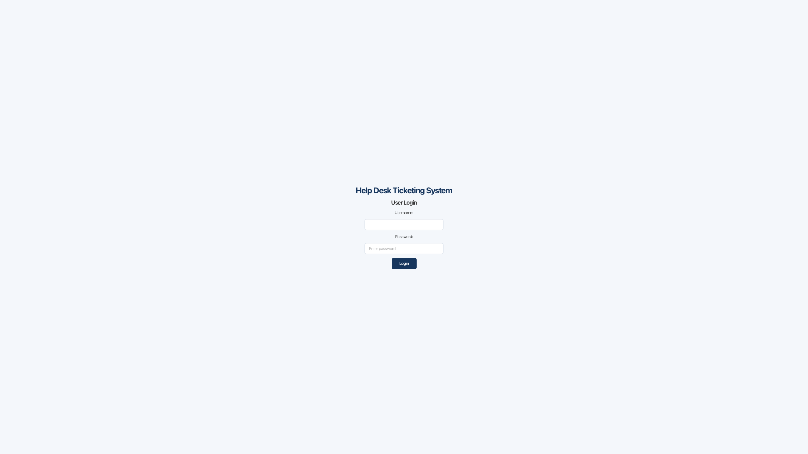
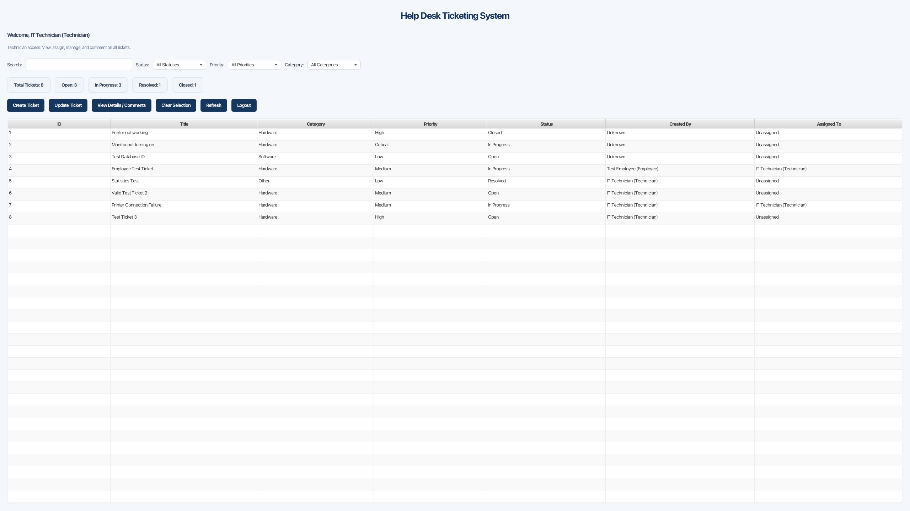
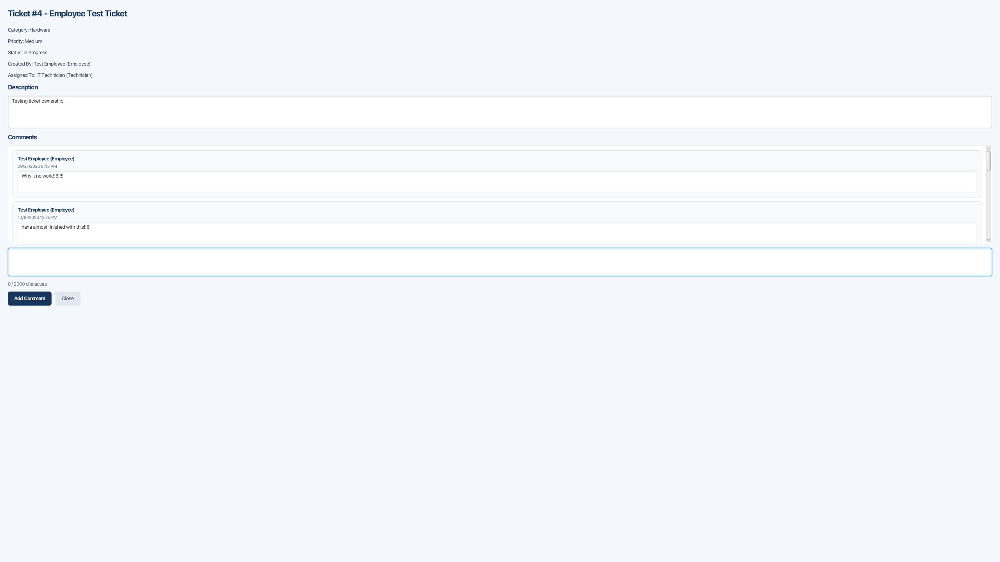

# Help Desk Ticketing System

A Java desktop application designed to provide a centralized system for creating, assigning, tracking, and resolving IT support tickets.

## Features

- User authentication
- Employee, Technician, and Administrator roles
- Role-based access control
- Create and manage support tickets
- Ticket ownership tracking
- Technician assignment
- Ticket status workflow
- Persistent ticket comments
- Ticket search and filtering
- Dashboard statistics
- Input validation and error handling
- Application logging
- SQLite database persistence
- Automated testing with JUnit 5

## Technologies Used

- Java 21
- JavaFX 21
- Maven
- SQLite
- JDBC
- JUnit 5
- Eclipse IDE

## Ticket Workflow

Open → In Progress → Resolved → Closed

Resolved tickets can also be reopened and returned to In Progress.

## User Roles

**Employee**
- Create support tickets
- View their own tickets
- Add comments to their tickets

**Technician**
- View and manage support tickets
- Update ticket information and status
- Assign tickets
- Add comments

**Administrator**
- View and manage support tickets
- Update ticket information and status
- Manage ticket assignments
- Add comments

## Project Status

Version 1.0 is being prepared for release as part of a Software Engineering Capstone project.

### Completed

- Authentication and role-based access control
- Ticket creation, updating, and deletion
- Ticket ownership and technician assignment
- Ticket status management
- Ticket details and persistent comments
- Search and filtering
- Dashboard statistics
- Input validation and error handling
- Application logging
- Automated testing (44 passing tests)
- JavaFX interface improvements

### Remaining

- Application screenshots
- Application packaging
- Final release preparation

## Running the Application

The project requires Java 21 and Maven.

1. Clone the repository.
2. Import the project into Eclipse as an existing Maven project.
3. Allow Maven to download the required dependencies.
4. Run the `javafx:run` Maven goal to start the application.

The application uses SQLite to store ticket and user information.

## Testing

The project includes automated JUnit 5 tests covering ticket validation, ticket status transitions, authorization rules, and database operations.

Run the tests using the Maven goal:

```bash
clean test
```

The current test suite contains 44 passing tests.

## Screenshots

### Login Screen


### Technician Dashboard


### Create Ticket


### Ticket Details and Comments


## Author

Matthew Z Cruse
